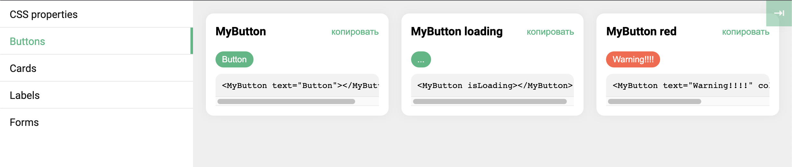

# My UI set
This is a simple set of vue-components for documenting and visualizing the UI-kit of your project.



## Code expample

```vue
<template>
  <div id="app">
    <!-- this need currentCategory prop -->
    <!-- eslint-disable-next-line vue/no-unused-vars -->
    <MyUi v-if="isDevMode" custom-css-properties-container=".my-ui" #default="{ currentCategory }">
      <MyUiCategory name="Buttons">
        <MyUiComponent>
          <MyButton text="Button"></MyButton>
        </MyUiComponent>

        <MyUiComponent name="MyButton loading">
          <MyButton is-loading></MyButton>
        </MyUiComponent>

        <MyUiComponent name="MyButton red">
          <MyButton color="red" text="Warning!!!!"></MyButton>
        </MyUiComponent>
      </MyUiCategory>
    </MyUi>
  </div>
</template>

<script>
import { MyUi, MyUiCategory, MyUiComponent } from 'my-ui-set';
// ...
</script>
```

## Components and props
### MyUi

**custom-css-properties-container** - container selector from which css properties will be taken.
By default, shows all custom css properties .

**button-position** ('left-top' | 'right-top' | 'right-bottom' | 'left-bottom') - position of toggle button 

### MyUiCategory
**name** - name of category

### MyUiComponent
**name** - name of component. By default, shows the component's vue tag 
